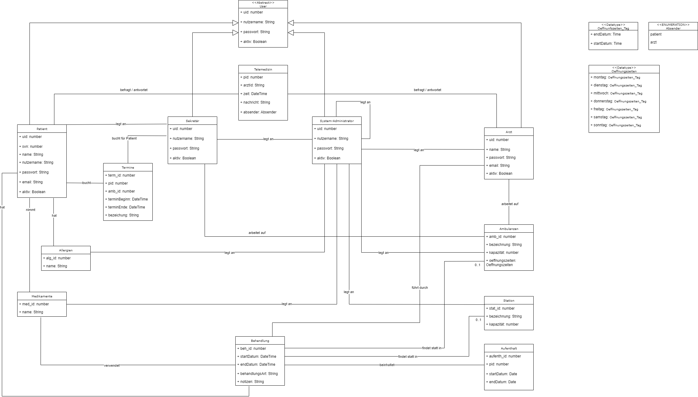

# Care Connect

## Table of Contents
1. Project Structure
2. Technology Stack
3. Domain Model

## Project Structure 
This section provides a basic overview of our project structure.

The `./documents/` directory is the location of all administrative files. This directory includes:
- **Jour Fixe**: Regular meetings to discuss project progress and issues.
- **PA**: Project Administration documents.
- **PV**: Project Vision documents.

## Technology Stack 
In this project, we use a multitude of technologies:
- **Frontend**: Written in Angular.
- **Backend**: Written in Java, using the Spring Framework.
- **Database**: Utilizes H2.

## Domain Model 
The domain model provides a visual representation of the database domain. It illustrates the entities, their attributes, and their relationships.

